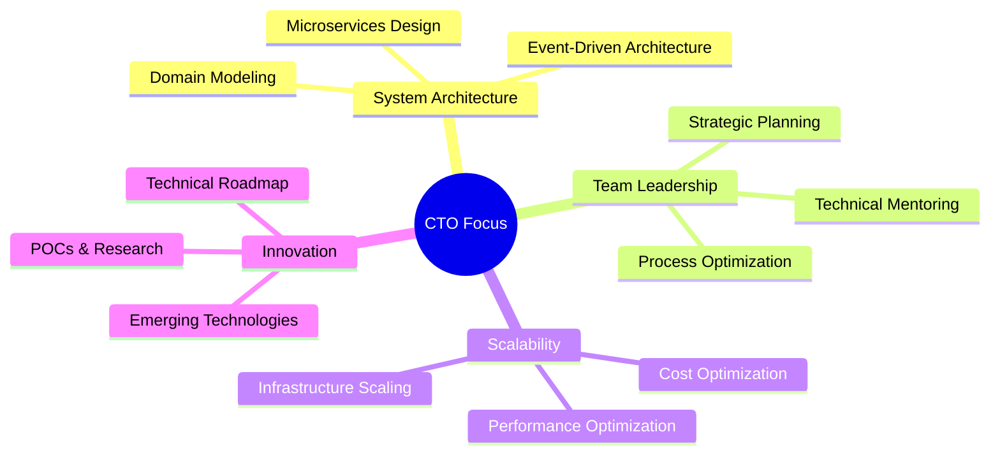

# 🚀 Rafael Calino | CTO & Microservices Architect

<div align="center">
  


</div>

## 🎯 About Me

```typescript
const rafaelCalino: CTOProfile = {
  role: "Chief Technology Officer",
  specialization: "Microservices Architecture & Scalable Systems",
  location: "🇧🇷 Brazil",
  currentFocus: ["System Architecture", "Team Leadership", "Cloud Migration"],
  
  expertise: {
    architecture: ["Microservices", "Event-Driven", "Domain-Driven Design"],
    cloud: ["AWS", "Docker", "Kubernetes", "Serverless"],
    messaging: ["RabbitMQ", "Apache Kafka", "Event Sourcing"],
    languages: ["Node.js", "Python", "Go", "TypeScript"],
    databases: ["PostgreSQL", "MongoDB", "Redis", "DynamoDB"]
  },
  
  leadership: {
    teamSize: "20+ Engineers",
    methodology: ["Agile", "DevOps", "CI/CD"],
    focus: ["Technical Excellence", "Scalable Solutions", "Team Growth"]
  }
}
```

## 🏆 Certifications & Achievements

<div align="center">

### ☁️ AWS Certifications


### 🐰 Messaging & Integration


</div>

## 🛠️ Tech Stack & Expertise

<div align="center">

### 🏗️ Architecture & Design


### ☁️ Cloud & Infrastructure


### 🚀 Languages & Frameworks


### 💾 Databases & Messaging


</div>

## 📊 GitHub Analytics

<div align="center">
  
  
</div>

<div align="center">
  
</div>

## 🎯 Current Focus Areas



## 🏗️ Architecture Philosophy

> **"Scalability is not just about handling more users, it's about building systems that evolve gracefully with business needs."**

### 🎨 Design Principles I Live By:

- **🔄 Event-Driven Architecture**: Loose coupling through messaging
- **🏛️ Domain-Driven Design**: Business logic at the center
- **⚡ Performance First**: Optimized from day one
- **🔒 Security by Design**: Built-in security patterns
- **📈 Observable Systems**: Monitoring and alerting everywhere
- **🤖 Automation Everything**: CI/CD, testing, deployments

## 🌟 Featured Projects

<div align="center">

[](https://github.com/rafaelcalino/nodejs-api-factory)

</div>

### 🎪 Project Highlights:
- **🏭 Factory Pattern APIs**: Scalable microservices with Node.js 22
- **🔐 JWT Authentication**: Secure token-based auth system
- **⚡ Rate Limiting**: Smart throttling for API protection
- **🧪 100% Test Coverage**: 121 automated tests
- **🚀 Docker Ready**: Containerized for easy deployment

## 📈 Leadership Impact

```typescript
const leadershipMetrics = {
  teamGrowth: "+150% in 2 years",
  systemReliability: "99.9% uptime",
  deploymentFrequency: "20+ deployments/week",
  incidentReduction: "-80% production issues",
  performanceGains: "+300% system throughput",
  costOptimization: "-40% infrastructure costs"
}
```

## 🔗 Let's Connect!

<div align="center">

[](https://linkedin.com/in/rafaelcalino)
[](https://twitter.com/rafaelcalino)
[](https://medium.com/@rafaelcalino)
[](https://youtube.com/@rafaelcalino)

</div>

---

<div align="center">

### 💡 *"Building the future, one microservice at a time"*


[](https://github.com/rafaelcalino)

</div>

---

## 🎯 Quick Stats

<div align="center">

| 🏆 Achievement | 📊 Metric |
|:---:|:---:|
| **Years of Experience** | 10+ |
| **Team Size Led** | 20+ Engineers |
| **Systems Architected** | 50+ Microservices |
| **AWS Certifications** | 3 Active |
| **Projects Delivered** | 100+ |
| **Uptime Achieved** | 99.9%+ |

</div>

**🚀 Ready to scale your systems to the next level? Let's talk!**
