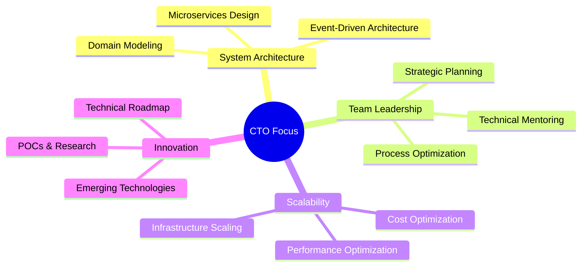

# 🔄 Refatoração Profissional: ChatService endChat

[]()
[]()
[]()

> **Demonstração de refatoração profissional**: Transformando código complexo e aninhado em código limpo, testável e manutenível.

## 📋 Sobre Este Projeto

Este repositório demonstra uma **refatoração completa e profissional** de um método complexo (`endChat`) que gerencia o encerramento de chats em um sistema de atendimento.

### 🎯 Objetivo

Mostrar como refatorar código legado complexo seguindo as melhores práticas de engenharia de software:
- ✅ Clean Code
- ✅ SOLID Principles
- ✅ DRY (Don't Repeat Yourself)
- ✅ Separation of Concerns
- ✅ High Testability

### 📊 Resultados

| Métrica | Antes | Depois | Melhoria |
|---------|-------|--------|----------|
| Linhas do método | 250+ | 70 | **72% ↓** |
| Níveis de aninhamento | 4+ | 2 | **50% ↓** |
| Complexidade ciclomática | ~25 | ~5 | **80% ↓** |
| Código duplicado | Alto | Zero | **100% ↓** |

## 🚀 Quick Start

```bash
# Ver o código refatorado
cat src/ChatService.js

# Executar testes de exemplo
node src/ChatService.test.js

# Ler documentação completa
cat REFACTORING_DOCUMENTATION.md
```

## 📚 Documentação

- **[REFACTORING_SUMMARY.md](./REFACTORING_SUMMARY.md)** - Visão geral executiva
- **[REFACTORING_DOCUMENTATION.md](./REFACTORING_DOCUMENTATION.md)** - Documentação técnica completa
- **[BEFORE_AFTER_COMPARISON.md](./BEFORE_AFTER_COMPARISON.md)** - Comparação visual antes vs depois
- **[src/ChatService.js](./src/ChatService.js)** - Código refatorado
- **[src/ChatService.test.js](./src/ChatService.test.js)** - Exemplos de testes

## 🎓 O Que Você Vai Aprender

1. **Como identificar** código complexo que precisa de refatoração
2. **Como aplicar** princípios SOLID na prática
3. **Como estruturar** métodos grandes em funções menores e focadas
4. **Como eliminar** código duplicado
5. **Como melhorar** testabilidade do código
6. **Como documentar** refatorações de forma clara

## 💡 Técnicas Aplicadas

- Extração de métodos (Extract Method)
- Delegação de responsabilidades
- Guard clauses e early returns
- Métodos privados (#) para encapsulamento
- Logs descritivos e estruturados
- Separação de lógica por tipo de operação

---

## 🏆 Certifications & Achievements

<div align="center">

### ☁️ AWS Certifications


### 🐰 Messaging & Integration


</div>

## 🎯 About Me

```typescript
const rafaelCalino: CTOProfile = {
  role: "Chief Technology Officer | IT Director",
  specialization: "Microservices Architecture & Scalable Systems",
  location: "🇧🇷 Brazil",
  currentFocus: ["System Architecture", "Team Leadership", "Cloud Migration"],
  
  expertise: {
    architecture: ["Microservices", "Event-Driven", "Domain-Driven Design"],
    cloud: ["AWS", "Docker", ,"ECS", "Kubernetes", "Serverless"],
    messaging: ["RabbitMQ", "Apache Kafka", "Event Sourcing"],
    languages: ["Node.js", "Python", "Asterisk"],
    databases: ["PostgreSQL", "MongoDB", "Redis", "DynamoDB"]
  },
  
  leadership: {
    teamSize: "20+ Engineers",
    methodology: ["Agile", "DevOps", "CI/CD"],
    focus: ["Technical Excellence", "Scalable Solutions", "Team Growth"]
  }
}
```

## 🛠️ Tech Stack & Expertise

<div align="center">

### 🏗️ Architecture & Design


### ☁️ Cloud & Infrastructure


### 🚀 Languages & Frameworks


### 💾 Databases & Messaging


</div>

## 📊 GitHub Analytics

<div align="center">
  
  
</div>

<div align="center">
  
</div>

## 🎯 Current Focus Areas


